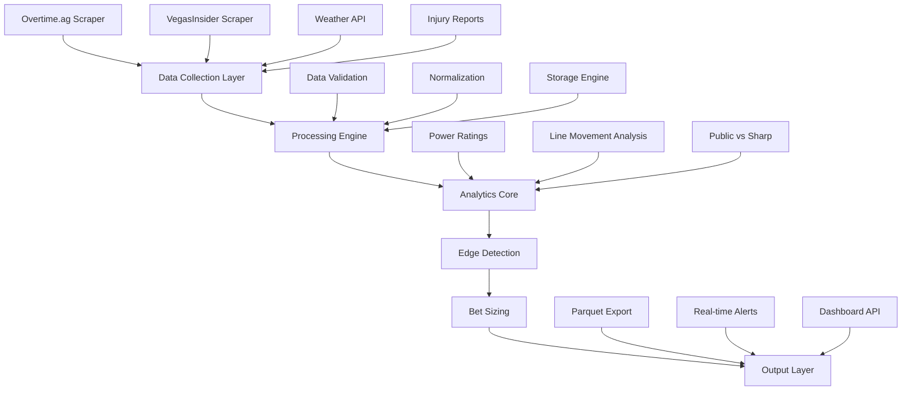

# Billy Walters Analytics System - Product Requirements Document

## Executive Summary

This PRD consolidates the Billy Walters betting analytics system that has been developed over multiple iterations, providing a unified framework for sports betting edge detection and automated data collection from overtime.ag. The system implements Walters' six core wagering principles with modern web scraping, real-time odds processing, and comprehensive statistical analysis.

## Table of Contents

1. [System Overview](#system-overview)
2. [Technical Architecture](#technical-architecture)
3. [Core Components](#core-components)
4. [Billy Walters Methodology](#billy-walters-methodology)
5. [Data Pipeline](#data-pipeline)
6. [Overtime.ag Integration](#overtimeag-integration)
7. [Success Metrics](#success-metrics)
8. [Testing Strategy](#testing-strategy)
9. [Development Roadmap](#development-roadmap)

---

## System Overview

### Purpose
Build a production-grade sports betting analytics platform that implements Billy Walters' proven methodologies for identifying value bets through systematic analysis of line movements, injury reports, weather data, and public betting patterns.

### Current Status
- ✅ Core Billy Walters principles implemented
- ✅ VegasInsider line movement scraping operational
- ✅ Weather impact analysis integrated
- ✅ Kelly Criterion bet sizing algorithm deployed
- ✅ NFL and college football data pipelines established
- ⏳ Overtime.ag real-time scraping (In Development)
- ⏳ Automated edge detection system (In Development)

### Technology Stack
```yaml
languages:
  - Python 3.11+
  
dependencies:
  - orjson: ">=3.11.4"      # Fast JSON parsing
  - pyarrow: ">=21.0.0"     # Parquet file handling
  - python-dotenv: ">=1.2.1" # Environment management
  - pydantic: ">=2.0"       # Data validation
  - pydantic-settings: ">=2.0"
  - scrapy: ">=2.13.3"      # Web scraping framework
  - scrapy-playwright: ">=0.0.44"  # JavaScript rendering
  - playwright: ">=1.47.0"   # Browser automation
  - playwright-stealth: ">=1.0.6"  # Anti-detection
  
testing:
  - pytest: ">=8.0"
  - pytest-asyncio
  - pytest-cov
  
package_management:
  - uv  # Modern Python package manager
```

---

## Technical Architecture

### System Components



---

## Core Components

### 1. Data Collection Module

```python
class DataCollector:
    """
    Orchestrates data collection from multiple sources
    """
    sources = {
        'overtime_ag': OvertimeAgScraper,
        'vegas_insider': VegasInsiderScraper,
        'weather': WeatherAPIClient,
        'injuries': InjuryReportScraper,
        'line_movement': LineMovementTracker
    }
    
    async def collect_all(self, games: List[Game]) -> DataFrame:
        """Collects data from all sources concurrently"""
        tasks = []
        for source_name, scraper in self.sources.items():
            tasks.append(scraper.fetch(games))
        results = await asyncio.gather(*tasks)
        return self.consolidate(results)
```

### 2. Billy Walters Power Rating System

```python
class PowerRatingSystem:
    """
    Implements Walters' proprietary power rating methodology
    """
    factors = {
        'recent_performance': 0.25,      # Last 3 games
        'strength_of_schedule': 0.20,    # Opponent quality
        'home_field_advantage': 0.15,    # Historical home performance
        'rest_days': 0.10,               # Days between games
        'injury_impact': 0.15,            # Key player availability
        'weather_adjustment': 0.10,       # Environmental factors
        'situational_spots': 0.05        # Lookahead/letdown spots
    }
    
    def calculate_rating(self, team: Team) -> float:
        """Calculate comprehensive power rating"""
        base_rating = self.get_base_rating(team)
        adjustments = self.calculate_adjustments(team)
        return base_rating + sum(adjustments.values())
```

### 3. Line Movement Analyzer

```python
class LineMovementAnalyzer:
    """
    Tracks and analyzes line movements to identify sharp action
    """
    def detect_reverse_line_movement(self, game: Game) -> bool:
        """
        Identifies when lines move opposite to public betting
        Key indicator of sharp money
        """
        public_percentage = game.public_betting_percentage
        line_movement = game.current_spread - game.opening_spread
        
        # Line moves toward team getting less than 40% of bets
        if public_percentage < 0.4 and line_movement < 0:
            return True
        elif public_percentage > 0.6 and line_movement > 0:
            return True
        return False
```

### 4. Kelly Criterion Implementation

```python
class KellyCriterion:
    """
    Optimal bet sizing based on edge and bankroll
    """
    def calculate_bet_size(
        self,
        edge: float,
        odds: float,
        bankroll: float,
        kelly_fraction: float = 0.25  # Conservative 1/4 Kelly
    ) -> float:
        """
        Calculate optimal bet size using Kelly Criterion
        """
        if edge <= 0:
            return 0
            
        probability = self.odds_to_probability(odds)
        kelly_percentage = (edge * probability) / abs(odds - 1)
        
        # Apply fractional Kelly for risk management
        bet_size = bankroll * kelly_percentage * kelly_fraction
        
        # Max 5% of bankroll per bet
        return min(bet_size, bankroll * 0.05)
```

---

## Billy Walters Methodology

### Six Core Principles

#### 1. **Power Ratings Supremacy**
- Develop proprietary ratings independent of market lines
- Update continuously with new data
- Weight recent performance heavily
- Account for matchup-specific advantages

#### 2. **Line Shopping Discipline**
- Monitor multiple sportsbooks simultaneously
- Track opening vs closing line value
- Identify steam moves and follow sharp action
- Never bet into bad numbers

#### 3. **Information Asymmetry**
- Gather injury information before markets adjust
- Monitor weather changes in real-time
- Track coaching decisions and lineup changes
- Leverage local beat reporter insights

#### 4. **Bankroll Management**
- Never risk more than 5% on a single bet
- Use fractional Kelly (25%) for sizing
- Maintain separate bankrolls for different sports
- Track ROI meticulously

#### 5. **Market Timing**
- Bet into opening lines for value
- Wait for public money to create opportunities
- Identify key numbers (3, 7 in NFL)
- Understand when to middle or hedge

#### 6. **Emotional Discipline**
- No revenge betting after losses
- Avoid betting personal favorite teams
- Skip marginal edges
- Take breaks during cold streaks

---

## Data Pipeline

### Collection → Processing → Analysis → Decision

```python
class BillyWaltersSystem:
    """
    Main orchestrator for the betting analytics system
    """
    def __init__(self):
        self.collector = DataCollector()
        self.processor = DataProcessor()
        self.analyzer = EdgeAnalyzer()
        self.bet_sizer = KellyCriterion()
        
    async def run_analysis(self, date: datetime) -> List[BettingEdge]:
        """
        Complete analysis pipeline
        """
        # 1. Collect data from all sources
        raw_data = await self.collector.collect_all(date)
        
        # 2. Process and normalize
        processed = self.processor.normalize(raw_data)
        
        # 3. Calculate power ratings
        ratings = self.calculate_power_ratings(processed)
        
        # 4. Identify edges
        edges = self.analyzer.find_edges(ratings, processed)
        
        # 5. Size bets optimally
        for edge in edges:
            edge.bet_size = self.bet_sizer.calculate_bet_size(
                edge.expected_value,
                edge.odds,
                self.bankroll
            )
            
        # 6. Export to Parquet for analysis
        self.export_results(edges, format='parquet')
        
        return edges
```

---

## Overtime.ag Integration

### Authentication Strategy

```python
class OvertimeAgScraper:
    """
    Handles authentication and data extraction from overtime.ag
    """
    def __init__(self):
        self.base_url = "https://overtime.ag/sports#/"
        self.session = None
        
    async def login(self, username: str, password: str):
        """
        Authenticate with overtime.ag using Playwright
        """
        async with async_playwright() as p:
            browser = await p.chromium.launch(headless=False)
            context = await browser.new_context()
            
            # Use playwright-stealth for anti-detection
            await stealth_async(context)
            
            page = await context.new_page()
            await page.goto(self.base_url)
            
            # Fill login form
            await page.fill('input[placeholder="Customer Id"]', username)
            await page.fill('input[placeholder="Password"]', password)
            await page.click('button:has-text("Login")')
            
            # Wait for authentication
            await page.wait_for_selector('.bet-slip', timeout=10000)
            
            # Save session for reuse
            self.session = await context.storage_state()
```

### Data Extraction Pipeline

```python
class OvertimeDataExtractor:
    """
    Extracts betting data from overtime.ag interface
    """
    
    async def extract_nfl_games(self, page: Page) -> List[Dict]:
        """
        Extract NFL game data including spreads, totals, and moneylines
        """
        games = []
        
        # Navigate to NFL section
        await page.click('text="NFL-Game/1H/2H/Qrts"')
        await page.wait_for_selector('.game-row')
        
        # Extract each game
        game_elements = await page.query_selector_all('.game-row')
        
        for game_elem in game_elements:
            game_data = {
                'timestamp': datetime.now().isoformat(),
                'sport': 'NFL',
                'teams': {
                    'away': await self.extract_team_name(game_elem, 'away'),
                    'home': await self.extract_team_name(game_elem, 'home')
                },
                'lines': {
                    'spread': {
                        'away': await self.extract_spread(game_elem, 'away'),
                        'home': await self.extract_spread(game_elem, 'home')
                    },
                    'moneyline': {
                        'away': await self.extract_moneyline(game_elem, 'away'),
                        'home': await self.extract_moneyline(game_elem, 'home')
                    },
                    'total': {
                        'over': await self.extract_total(game_elem, 'over'),
                        'under': await self.extract_total(game_elem, 'under')
                    }
                },
                'game_time': await self.extract_game_time(game_elem)
            }
            games.append(game_data)
            
        return games
    
    async def extract_college_games(self, page: Page) -> List[Dict]:
        """
        Extract college football games with same structure
        """
        await page.click('text="COLLEGE FB(1H/2H/Q)"')
        # Similar extraction logic for college games
        pass
```

### Real-time Monitoring

```python
class OvertimeAgMonitor:
    """
    Monitors overtime.ag for line changes and opportunities
    """
    
    def __init__(self, check_interval: int = 60):
        self.check_interval = check_interval
        self.previous_lines = {}
        self.alerts = []
        
    async def monitor_lines(self):
        """
        Continuously monitor for line movements
        """
        while True:
            current_lines = await self.scraper.get_current_lines()
            
            for game_id, lines in current_lines.items():
                if game_id in self.previous_lines:
                    movement = self.detect_movement(
                        self.previous_lines[game_id],
                        lines
                    )
                    
                    if movement and movement.is_significant():
                        alert = self.create_alert(game_id, movement)
                        await self.send_alert(alert)
                        
            self.previous_lines = current_lines
            await asyncio.sleep(self.check_interval)
    
    def detect_movement(self, old_lines: Dict, new_lines: Dict) -> Movement:
        """
        Detect significant line movements
        """
        spread_move = new_lines['spread'] - old_lines['spread']
        total_move = new_lines['total'] - old_lines['total']
        
        return Movement(
            spread_change=spread_move,
            total_change=total_move,
            timestamp=datetime.now()
        )
```

---

## Success Metrics

### Key Performance Indicators (KPIs)

```yaml
accuracy_metrics:
  - edge_detection_accuracy: ">65%"  # Correctly identified +EV bets
  - roi_target: ">5%"                # Return on investment
  - win_rate: ">52.4%"              # Break-even for -110 odds
  
system_metrics:
  - data_freshness: "<30 seconds"    # Real-time data latency
  - scraping_success_rate: ">99%"    # Reliability
  - processing_time: "<5 seconds"    # End-to-end pipeline
  
risk_metrics:
  - max_drawdown: "<20%"            # Maximum bankroll loss
  - sharpe_ratio: ">1.5"             # Risk-adjusted returns
  - kelly_compliance: "100%"         # Bet sizing discipline
```

### Performance Tracking

```python
class PerformanceTracker:
    """
    Track and analyze system performance
    """
    
    def __init__(self):
        self.bets = []
        self.results = []
        
    def calculate_roi(self) -> float:
        """Calculate return on investment"""
        total_wagered = sum(bet.amount for bet in self.bets)
        total_profit = sum(result.profit for result in self.results)
        return (total_profit / total_wagered) * 100
    
    def calculate_sharpe_ratio(self) -> float:
        """Calculate risk-adjusted returns"""
        returns = [r.profit / r.bet.amount for r in self.results]
        return np.mean(returns) / np.std(returns) * np.sqrt(252)
    
    def generate_report(self) -> Dict:
        """Generate comprehensive performance report"""
        return {
            'total_bets': len(self.bets),
            'win_rate': self.calculate_win_rate(),
            'roi': self.calculate_roi(),
            'sharpe_ratio': self.calculate_sharpe_ratio(),
            'max_drawdown': self.calculate_max_drawdown(),
            'by_sport': self.analyze_by_sport(),
            'by_bet_type': self.analyze_by_bet_type(),
            'edge_accuracy': self.calculate_edge_accuracy()
        }
```

---

## Testing Strategy

### Unit Testing

```python
# tests/test_power_ratings.py
import pytest
from analytics.power_ratings import PowerRatingSystem

class TestPowerRatings:
    @pytest.fixture
    def rating_system(self):
        return PowerRatingSystem()
    
    def test_home_field_advantage(self, rating_system):
        """Test home field advantage calculation"""
        team = Team(name="Test Team", is_home=True)
        advantage = rating_system.calculate_home_advantage(team)
        assert advantage > 0
        assert advantage <= 3.5  # NFL typical range
    
    def test_injury_impact(self, rating_system):
        """Test injury impact on ratings"""
        injuries = [
            Injury(player="QB1", impact="OUT"),
            Injury(player="RB1", impact="QUESTIONABLE")
        ]
        impact = rating_system.calculate_injury_impact(injuries)
        assert impact < 0  # Should reduce rating
```

### Integration Testing

```python
# tests/test_overtime_scraper.py
import pytest
from scrapers.overtime_ag import OvertimeAgScraper

class TestOvertimeScraper:
    @pytest.mark.asyncio
    async def test_login_success(self):
        """Test successful authentication"""
        scraper = OvertimeAgScraper()
        result = await scraper.login(
            username=os.getenv("OVERTIME_USER"),
            password=os.getenv("OVERTIME_PASS")
        )
        assert result.success is True
        assert scraper.session is not None
    
    @pytest.mark.asyncio
    async def test_data_extraction(self):
        """Test data extraction from overtime.ag"""
        scraper = OvertimeAgScraper()
        await scraper.login(
            username=os.getenv("OVERTIME_USER"),
            password=os.getenv("OVERTIME_PASS")
        )
        
        games = await scraper.extract_nfl_games()
        assert len(games) > 0
        assert all('spread' in game['lines'] for game in games)
```

### End-to-End Testing

```python
# tests/test_e2e_pipeline.py
class TestEndToEndPipeline:
    @pytest.mark.asyncio
    async def test_complete_analysis_pipeline(self):
        """Test complete analysis from data collection to bet sizing"""
        system = BillyWaltersSystem()
        
        # Run full pipeline
        edges = await system.run_analysis(date=datetime.now())
        
        # Verify outputs
        assert len(edges) >= 0  # May have no edges
        for edge in edges:
            assert edge.expected_value > 0
            assert 0 < edge.bet_size <= system.bankroll * 0.05
            assert edge.confidence_level in ['HIGH', 'MEDIUM', 'LOW']
```

---

## Development Roadmap

### Phase 1: Foundation (Completed ✅)
- [x] Billy Walters methodology research
- [x] Core power rating system
- [x] Basic web scraping infrastructure
- [x] Kelly Criterion implementation
- [x] Weather impact analysis

### Phase 2: Overtime.ag Integration (Current 🏗️)
- [ ] Authentication system
- [ ] Real-time odds scraping
- [ ] Line movement tracking
- [ ] Alert system for opportunities
- [ ] Data validation and error handling

### Phase 3: Advanced Analytics (Q1 2025)
- [ ] Machine learning model for edge detection
- [ ] Historical backtesting framework
- [ ] Advanced situational analysis
- [ ] Correlation analysis between games
- [ ] Referee and venue impact modeling

### Phase 4: Automation & Scaling (Q2 2025)
- [ ] Fully automated betting execution
- [ ] Multi-sport expansion (NBA, MLB)
- [ ] Real-time dashboard development
- [ ] API for third-party integration
- [ ] Cloud deployment (AWS/GCP)

### Phase 5: Optimization (Q3 2025)
- [ ] Neural network for line prediction
- [ ] Sentiment analysis integration
- [ ] Advanced arbitrage detection
- [ ] Portfolio optimization across sports
- [ ] Regulatory compliance framework

---

## Risk Management

### Technical Risks

```yaml
risks:
  - name: "Website Structure Changes"
    probability: HIGH
    impact: HIGH
    mitigation: 
      - "Implement robust selectors"
      - "Use multiple fallback strategies"
      - "Monitor for changes daily"
      
  - name: "Rate Limiting / IP Bans"
    probability: MEDIUM
    impact: HIGH
    mitigation:
      - "Implement rotating proxies"
      - "Use realistic delays"
      - "Distribute requests across time"
      
  - name: "Data Quality Issues"
    probability: MEDIUM
    impact: MEDIUM
    mitigation:
      - "Multiple data source validation"
      - "Anomaly detection algorithms"
      - "Manual review triggers"
```

### Business Risks

```yaml
regulatory:
  - Ensure compliance with local gambling laws
  - Implement responsible gambling features
  - Maintain audit trail of all decisions
  
financial:
  - Never exceed predetermined bankroll limits
  - Implement stop-loss mechanisms
  - Regular performance reviews
  
reputational:
  - Focus on statistical research
  - Emphasize educational purpose
  - Transparent methodology documentation
```

---

## Implementation Guidelines

### Code Standards

```python
"""
Billy Walters Analytics System - Code Standards

1. Type hints for all functions
2. Comprehensive docstrings (Google style)
3. Error handling with specific exceptions
4. Async/await for I/O operations
5. Logging at appropriate levels
6. Configuration via environment variables
7. Unit tests with >80% coverage
8. Integration tests for critical paths
"""

from typing import List, Dict, Optional, Union
from datetime import datetime
from decimal import Decimal
import logging

logger = logging.getLogger(__name__)

class BettingEdge:
    """
    Represents a identified betting opportunity
    
    Attributes:
        game: Game object with teams and time
        edge_type: Type of edge (SPREAD, TOTAL, MONEYLINE)
        expected_value: Calculated EV percentage
        confidence: Confidence level (HIGH, MEDIUM, LOW)
        bet_size: Recommended bet size from Kelly
        factors: List of factors contributing to edge
    """
    
    def __init__(
        self,
        game: Game,
        edge_type: str,
        expected_value: float,
        confidence: str,
        factors: List[str]
    ) -> None:
        self.game = game
        self.edge_type = edge_type
        self.expected_value = expected_value
        self.confidence = confidence
        self.factors = factors
        self.bet_size: Optional[Decimal] = None
        
    def to_parquet_row(self) -> Dict:
        """Convert to Parquet-compatible dictionary"""
        return {
            'timestamp': datetime.now().isoformat(),
            'game_id': self.game.id,
            'teams': f"{self.game.away_team} @ {self.game.home_team}",
            'edge_type': self.edge_type,
            'expected_value': self.expected_value,
            'confidence': self.confidence,
            'bet_size': float(self.bet_size) if self.bet_size else 0,
            'factors': '|'.join(self.factors)
        }
```

### Deployment Configuration

```yaml
# docker-compose.yml
version: '3.8'

services:
  scraper:
    build: .
    environment:
      - OVERTIME_USER=${OVERTIME_USER}
      - OVERTIME_PASS=${OVERTIME_PASS}
      - DATABASE_URL=${DATABASE_URL}
    volumes:
      - ./data:/app/data
    networks:
      - betting_network
      
  redis:
    image: redis:alpine
    ports:
      - "6379:6379"
    networks:
      - betting_network
      
  postgres:
    image: postgres:14
    environment:
      - POSTGRES_DB=betting_analytics
      - POSTGRES_USER=${DB_USER}
      - POSTGRES_PASSWORD=${DB_PASS}
    volumes:
      - postgres_data:/var/lib/postgresql/data
    networks:
      - betting_network

networks:
  betting_network:
    driver: bridge

volumes:
  postgres_data:
```

---

## Conclusion

This PRD represents the consolidation of all Billy Walters betting analytics work into a unified system. The integration with overtime.ag provides real-time odds access, while maintaining the sophisticated analytical framework that has been developed over multiple iterations.

### Key Success Factors
1. **Disciplined Implementation** - Stick to Walters' proven principles
2. **Data Quality** - Multiple sources for validation
3. **Risk Management** - Never exceed Kelly recommendations
4. **Continuous Improvement** - Track, measure, and optimize
5. **Technical Excellence** - Robust, tested, scalable code

### Next Steps
1. Complete overtime.ag authentication module
2. Deploy real-time monitoring system
3. Backtest against historical data
4. Begin small-scale live testing
5. Iterate based on performance metrics

---

## Appendix

### A. Billy Walters Resources
- "Gambler: Secrets from a Life at Risk" (Autobiography)
- ESPN 60 Minutes Interview Transcripts
- Court documents from insider trading case (betting methodology)
- Las Vegas Review-Journal articles

### B. Technical Resources
- Scrapy documentation: https://docs.scrapy.org/
- Playwright docs: https://playwright.dev/python/
- Kelly Criterion papers (Kelly, 1956)
- Modern portfolio theory applications to sports betting

### C. API Endpoints (Future)
```yaml
endpoints:
  - /api/edges: Current betting edges
  - /api/performance: Historical performance
  - /api/lines: Current lines from all books
  - /api/alerts: Real-time opportunity alerts
  - /ws/live: WebSocket for live updates
```

### D. Database Schema
```sql
-- Core tables for analytics system
CREATE TABLE games (
    id UUID PRIMARY KEY,
    sport VARCHAR(10),
    away_team VARCHAR(100),
    home_team VARCHAR(100),
    game_time TIMESTAMP,
    created_at TIMESTAMP DEFAULT NOW()
);

CREATE TABLE lines (
    id UUID PRIMARY KEY,
    game_id UUID REFERENCES games(id),
    book VARCHAR(50),
    line_type VARCHAR(20),
    value DECIMAL(10, 2),
    odds INTEGER,
    timestamp TIMESTAMP,
    INDEX idx_game_book (game_id, book),
    INDEX idx_timestamp (timestamp)
);

CREATE TABLE edges (
    id UUID PRIMARY KEY,
    game_id UUID REFERENCES games(id),
    edge_type VARCHAR(20),
    expected_value DECIMAL(5, 2),
    confidence VARCHAR(10),
    bet_size DECIMAL(10, 2),
    created_at TIMESTAMP DEFAULT NOW()
);

CREATE TABLE results (
    id UUID PRIMARY KEY,
    edge_id UUID REFERENCES edges(id),
    bet_amount DECIMAL(10, 2),
    odds INTEGER,
    result VARCHAR(10),
    profit DECIMAL(10, 2),
    settled_at TIMESTAMP
);
```

---

*Document Version: 1.0*  
*Last Updated: November 2025*  
*Author: Andy & Claude*  
*Status: Active Development*
