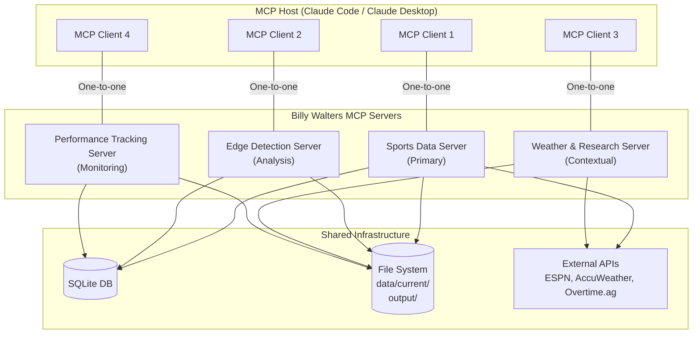
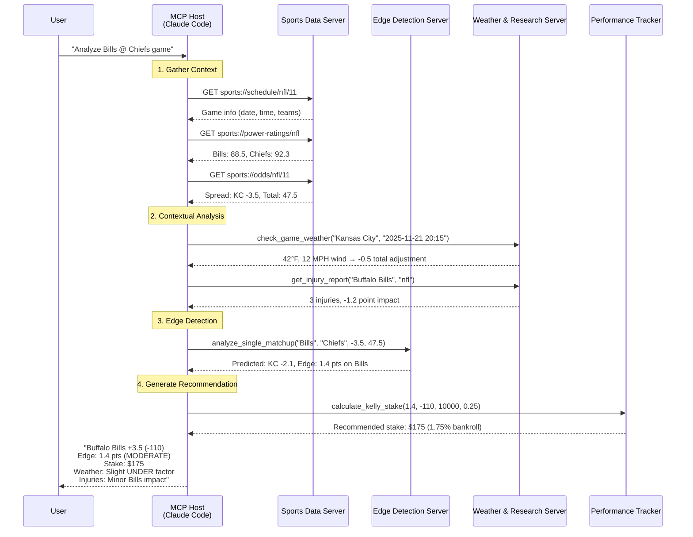

# Billy Walters Sports Analyzer - MCP Server Architecture

**Version**: 1.0
**Date**: 2025-11-21
**Status**: Architecture Design

## Executive Summary

This document defines the Model Context Protocol (MCP) server architecture for the Billy Walters Sports Analyzer project. The architecture transforms the existing workflow-based system into a modular, AI-native interface that exposes sports betting analysis capabilities through standardized MCP primitives (Tools, Resources, Prompts).

**Key Decisions**:
- **Multi-Server Architecture**: Separate servers for data, analysis, and research domains
- **Progressive Migration**: Incrementally enhance existing MCP server without disrupting workflow
- **Workflow Preservation**: All existing slash commands remain functional
- **AI-First Design**: Optimized for LLM consumption and tool calling

---

## Table of Contents

1. [Current State Analysis](#current-state-analysis)
2. [Architecture Overview](#architecture-overview)
3. [Server Specifications](#server-specifications)
4. [Implementation Roadmap](#implementation-roadmap)
5. [Integration Patterns](#integration-patterns)
6. [Security & Performance](#security--performance)

---

## Current State Analysis

### Existing MCP Implementation

**File**: `.claude/walters_mcp_server.py`

**Current Capabilities**:
- **Tools (3)**: `analyze_game`, `calculate_kelly_stake`, `get_injury_report`
- **Resources (2)**: `walters://betting-history`, `walters://system-config`
- **Prompts**: None defined

**Status**: ✅ Functional but underutilized

### Existing Workflow System

**27 Slash Commands** organized by domain:

| Domain | Commands | Purpose |
|--------|----------|---------|
| **Data Collection** | `collect-all-data`, `scrape-massey`, `scrape-overtime`, `espn-team-stats`, `espn-player-stats`, `espn-ncaaf`, `espn-ncaaf-scoreboard` | Gather odds, power ratings, team stats, schedules |
| **Analysis** | `edge-detector`, `analyze-matchup`, `odds-analysis`, `in-play-matchup-now`, `in-play-matchup-interval` | Detect betting edges, analyze games |
| **Validation** | `validate-data`, `check-results` | Quality assurance |
| **Tracking** | `clv-tracker`, `betting-card`, `live-odds`, `scrape-live-odds` | Performance monitoring |
| **Contextual** | `weather`, `injury-report`, `team-stats`, `current-week` | Situational analysis |
| **Utilities** | `update-data`, `power-ratings`, `document-lesson`, `document-overtime-setup`, `lessons` | Maintenance and documentation |

**Status**: ✅ Comprehensive but not AI-accessible

### Gap Analysis

| Capability | Slash Commands | MCP Server | Status |
|------------|----------------|------------|--------|
| Data Collection | ✅ 7 commands | ❌ Not exposed | **GAP** |
| Edge Detection | ✅ 5 commands | ⚠️ Partial (analyze_game) | **GAP** |
| Weather Analysis | ✅ 1 command | ❌ Not exposed | **GAP** |
| Injury Analysis | ✅ 1 command | ✅ get_injury_report | OK |
| Odds Tracking | ✅ 4 commands | ❌ Not exposed | **GAP** |
| Performance Tracking | ✅ 2 commands | ⚠️ Partial (resource) | **GAP** |
| Power Ratings | ✅ 1 command | ❌ Not exposed | **GAP** |
| Team Statistics | ✅ 1 command | ❌ Not exposed | **GAP** |
| Prompts/Templates | ❌ None | ❌ None | **MISSING** |

**Conclusion**: Only 15% of workflow capabilities are exposed via MCP. Significant opportunity for AI integration.

---

## Architecture Overview

### Design Principles

1. **Separation of Concerns**: Domain-specific servers for data, analysis, and research
2. **Progressive Enhancement**: Build on existing MCP server without breaking changes
3. **Workflow Compatibility**: Maintain all slash commands for human users
4. **AI-First Interface**: Optimize for LLM tool calling and context provision
5. **Single Responsibility**: Each server focuses on one domain

### Proposed Architecture: Multi-Server Composition



### Server Roles

| Server | Domain | Primary Purpose | Dependencies |
|--------|--------|-----------------|--------------|
| **Sports Data Server** | Data Collection | Gather odds, schedules, team stats | ESPN API, Overtime.ag API, Massey Ratings |
| **Edge Detection Server** | Analysis | Detect betting edges, calculate value | Sports Data Server, Power Ratings DB |
| **Weather & Research Server** | Contextual | Weather impact, injury analysis | AccuWeather API, ESPN Injury API |
| **Performance Tracking Server** | Monitoring | CLV tracking, betting history, ROI | SQLite DB, Historical Odds |

---

## Server Specifications

### 1. Sports Data Server (Primary)

**Purpose**: Centralized data collection and aggregation

**File**: `.claude/mcp_servers/sports_data_server.py`

#### Tools

| Tool | Purpose | Parameters | Returns |
|------|---------|------------|---------|
| `collect_week_data` | Gather all data for current week | `week: int, league: str, include_weather: bool` | Collection summary with status |
| `scrape_massey_ratings` | Fetch Massey composite ratings | `league: str, force_refresh: bool` | Power ratings for all teams |
| `scrape_overtime_odds` | Get current odds from Overtime.ag | `league: str, format: str` | Odds in Billy Walters format |
| `get_espn_team_stats` | Fetch team statistics | `team: str, league: str, week: int` | Team stats (PPG, PAPG, yards) |
| `get_espn_schedule` | Retrieve game schedule | `league: str, week: int` | Games with dates/times |
| `get_current_nfl_week` | Calculate current NFL week | - | Week number and date range |
| `validate_collected_data` | Check data quality | `week: int, league: str` | Validation report with score |

#### Resources

| URI Template | Description | MIME Type |
|--------------|-------------|-----------|
| `sports://odds/{league}/{week}` | Current odds for week | `application/json` |
| `sports://schedule/{league}/{week}` | Game schedule | `application/json` |
| `sports://teams/{league}/stats` | All team statistics | `application/json` |
| `sports://power-ratings/{league}` | Power ratings (Massey + ESPN) | `application/json` |
| `sports://data-status/{week}` | Data collection status | `application/json` |

**Resource Examples**:
```
sports://odds/nfl/11                    # NFL Week 11 odds
sports://schedule/ncaaf/12              # NCAAF Week 12 schedule
sports://teams/nfl/stats                # All NFL team stats
sports://power-ratings/ncaaf            # NCAAF power ratings
sports://data-status/11                 # Week 11 data quality
```

#### Prompts

| Prompt | Description | Arguments | Output |
|--------|-------------|-----------|--------|
| `collect-weekly-data` | Complete data collection workflow | `week, league` | Step-by-step collection with validation |
| `refresh-odds` | Update odds before game day | `league, games` | Updated odds and line movements |
| `prepare-analysis` | Gather all data for edge detection | `week, league` | Complete dataset ready for analysis |

**Example Prompt**:
```json
{
  "name": "collect-weekly-data",
  "title": "Collect All Data for Week",
  "description": "Complete Billy Walters data collection workflow",
  "arguments": [
    {"name": "week", "type": "number", "required": true},
    {"name": "league", "type": "string", "enum": ["nfl", "ncaaf"]},
    {"name": "include_weather", "type": "boolean", "default": true}
  ]
}
```

---

### 2. Edge Detection Server (Analysis)

**Purpose**: Betting analysis and value identification

**File**: `.claude/mcp_servers/edge_detection_server.py`

#### Tools

| Tool | Purpose | Parameters | Returns |
|------|---------|------------|---------|
| `detect_spread_edges` | Find spread betting value | `week: int, league: str, min_edge: float` | Games with detected edges |
| `detect_total_edges` | Find totals betting value | `week: int, league: str, min_edge: float` | Over/under opportunities |
| `analyze_single_matchup` | Deep dive on one game | `away_team: str, home_team: str, spread: float, total: float` | Comprehensive analysis |
| `calculate_power_rating` | Compute enhanced power rating | `team: str, league: str, include_stats: bool` | Power rating with components |
| `compare_lines` | Market line vs predicted | `game_id: str` | Line comparison with value |
| `check_key_numbers` | Identify key number edges | `spread: float, predicted: float` | Key number alerts |

#### Resources

| URI Template | Description | MIME Type |
|--------------|-------------|-----------|
| `edges://detected/{league}/{week}` | All detected edges | `application/json` |
| `edges://game/{game_id}` | Single game analysis | `application/json` |
| `edges://history/{league}/{weeks}` | Historical edges | `application/json` |
| `edges://report/{week}` | Formatted betting card | `text/markdown` |

**Resource Examples**:
```
edges://detected/nfl/11                  # NFL Week 11 edges
edges://game/BUF_KC_20251121             # Bills @ Chiefs analysis
edges://history/nfl/1-11                 # NFL season edges
edges://report/11                        # Week 11 betting card
```

#### Prompts

| Prompt | Description | Arguments | Output |
|--------|-------------|-----------|--------|
| `find-value-bets` | Complete edge detection workflow | `week, league, min_edge` | Ranked betting opportunities |
| `analyze-matchup` | Detailed game breakdown | `away_team, home_team` | Multi-factor analysis |
| `generate-betting-card` | Weekly recommendations | `week, league` | Formatted betting card |

---

### 3. Weather & Research Server (Contextual)

**Purpose**: Environmental and situational analysis

**File**: `.claude/mcp_servers/weather_research_server.py`

#### Tools

| Tool | Purpose | Parameters | Returns |
|------|---------|------------|---------|
| `check_game_weather` | Weather impact analysis | `team: str, game_time: str, stadium: str` | Weather conditions + adjustments |
| `get_injury_report` | Comprehensive injury analysis | `team: str, league: str` | Injuries with point values |
| `analyze_injury_impact` | Position-specific impact | `injuries: list, position: str` | Impact score and recommendation |
| `calculate_weather_adjustments` | Billy Walters weather rules | `temp: float, wind: float, precip: float` | Spread and total adjustments |
| `get_stadium_info` | Stadium details | `team: str` | Indoor/outdoor, location, weather history |

#### Resources

| URI Template | Description | MIME Type |
|--------------|-------------|-----------|
| `weather://forecast/{city}/{date}` | Weather forecast for game | `application/json` |
| `weather://impact/{game_id}` | Weather impact on game | `application/json` |
| `injuries://team/{team}/{league}` | Team injury report | `application/json` |
| `injuries://position/{position}` | Position impact values | `application/json` |
| `stadium://info/{team}` | Stadium information | `application/json` |

**Resource Examples**:
```
weather://forecast/buffalo/2025-11-21    # Buffalo weather for game day
weather://impact/BUF_KC_20251121         # Weather impact on Bills/Chiefs
injuries://team/buffalo/nfl              # Bills injury report
injuries://position/qb                   # QB injury values
stadium://info/buffalo                   # Highmark Stadium info
```

#### Prompts

| Prompt | Description | Arguments | Output |
|--------|-------------|-----------|--------|
| `weather-analysis` | Complete weather impact | `team, game_time` | Weather conditions + betting adjustments |
| `injury-impact` | Injury-adjusted edge | `team, league` | Injury report with edge adjustments |

---

### 4. Performance Tracking Server (Monitoring)

**Purpose**: Bet tracking and performance analytics

**File**: `.claude/mcp_servers/performance_tracking_server.py`

#### Tools

| Tool | Purpose | Parameters | Returns |
|------|---------|------------|---------|
| `track_clv` | Closing Line Value tracking | `game_id: str, bet_line: float, closing_line: float` | CLV calculation |
| `log_bet` | Record betting decision | `game_id: str, bet_type: str, line: float, stake: float` | Bet record |
| `calculate_roi` | Return on investment | `date_range: str, league: str` | ROI metrics |
| `get_betting_history` | Historical performance | `limit: int, league: str` | Bet history with results |
| `generate_performance_report` | Comprehensive stats | `date_range: str` | Win rate, CLV, ROI, Sharpe ratio |
| `calculate_kelly_stake` | Optimal bet sizing | `edge: float, odds: int, bankroll: float, kelly_fraction: float` | Recommended stake |

#### Resources

| URI Template | Description | MIME Type |
|--------------|-------------|-----------|
| `performance://history/{weeks}` | Betting history | `application/json` |
| `performance://clv/{league}` | CLV tracking | `application/json` |
| `performance://roi/{league}` | ROI by league | `application/json` |
| `performance://report/{date_range}` | Performance report | `text/markdown` |
| `performance://config` | System configuration | `application/json` |

**Resource Examples**:
```
performance://history/1-11               # Season bet history
performance://clv/nfl                    # NFL CLV tracking
performance://roi/ncaaf                  # NCAAF ROI
performance://report/2025-09-01:2025-11-21  # Season report
performance://config                     # Bankroll settings
```

#### Prompts

| Prompt | Description | Arguments | Output |
|--------|-------------|-----------|--------|
| `track-performance` | Log bet and track CLV | `game_id, bet_type, line, stake` | Bet record with expected CLV |
| `review-performance` | Performance summary | `date_range` | Comprehensive performance report |

---

## Implementation Roadmap

### Phase 1: Foundation (Week 1) ✅ PRIORITY

**Goal**: Enhance existing MCP server with core data collection tools

**Tasks**:
1. Add missing tools to `walters_mcp_server.py`:
   - `collect_week_data`
   - `scrape_massey_ratings`
   - `scrape_overtime_odds`
   - `validate_collected_data`

2. Add data resources:
   - `sports://odds/{league}/{week}`
   - `sports://power-ratings/{league}`
   - `sports://data-status/{week}`

3. Add first prompt:
   - `collect-weekly-data` prompt

**Deliverable**: Enhanced single MCP server with 10+ tools

**Testing**: Verify all tools work via MCP Inspector

### Phase 2: Modularization (Week 2)

**Goal**: Split into specialized servers

**Tasks**:
1. Extract data collection → `sports_data_server.py`
2. Extract analysis → `edge_detection_server.py`
3. Update configuration for multi-server setup
4. Test server composition

**Deliverable**: 3 independent MCP servers (Data, Analysis, Tracking)

**Testing**: Verify servers work together in Claude Desktop

### Phase 3: Contextual Intelligence (Week 3)

**Goal**: Add weather and research server

**Tasks**:
1. Create `weather_research_server.py`
2. Implement weather tools and resources
3. Implement injury tools and resources
4. Add prompts for contextual analysis

**Deliverable**: Complete 4-server architecture

**Testing**: End-to-end workflow from data collection to bet placement

### Phase 4: Optimization (Week 4)

**Goal**: Performance, caching, and monitoring

**Tasks**:
1. Add request caching for expensive operations
2. Implement rate limiting for external APIs
3. Add comprehensive logging and error handling
4. Create monitoring dashboard

**Deliverable**: Production-ready MCP infrastructure

**Testing**: Load testing, error scenarios, API failure handling

---

## Integration Patterns

### How Multiple Servers Work Together

**Example: Complete Game Analysis Workflow**



### LLM Tool Calling Pattern

**How the LLM discovers and uses MCP tools**:

1. **Discovery Phase**:
   ```
   User: "What's the best NFL bet this week?"

   LLM thinks: I need to find betting opportunities
   LLM calls: Sports Data Server → tools/list
   LLM calls: Edge Detection Server → tools/list
   LLM discovers: collect_week_data, detect_spread_edges, etc.
   ```

2. **Data Collection**:
   ```
   LLM calls: collect_week_data(week=11, league="nfl", include_weather=true)
   Result: "Collected odds (13 games), power ratings (32 teams), schedules"
   ```

3. **Analysis**:
   ```
   LLM calls: detect_spread_edges(week=11, league="nfl", min_edge=1.0)
   Result: 4 games with 1+ point edge
   ```

4. **Contextual Enhancement**:
   ```
   For each game with edge:
     LLM calls: get_injury_report(team, "nfl")
     LLM calls: check_game_weather(team, game_time)
   ```

5. **Recommendation**:
   ```
   LLM synthesizes: "Best bets:
     1. Bills +3.5 (1.4 edge)
     2. Bears +7.0 (1.8 edge)
     3. Titans +6.5 (1.2 edge)"
   ```

---

## Security & Performance

### Authentication & Authorization

**Current State**: No authentication (local servers)

**Recommendations**:
- Local servers: No auth required (STDIO transport)
- Remote servers (future): OAuth 2.0 with bearer tokens

### Rate Limiting

**API Limits**:
- AccuWeather: 50 calls/day (Starter plan)
- ESPN: No official limit, use 1 req/sec
- Overtime.ag API: No auth, assume 100 calls/hour

**MCP Server Caching**:
```python
# Cache power ratings for 24 hours
@cache(ttl=86400)
async def scrape_massey_ratings(league: str) -> dict:
    ...

# Cache odds for 5 minutes (live updates)
@cache(ttl=300)
async def scrape_overtime_odds(league: str) -> dict:
    ...

# Cache weather forecasts for 1 hour
@cache(ttl=3600)
async def check_game_weather(city: str, date: str) -> dict:
    ...
```

### Performance Optimization

**Resource Loading**:
- Use lazy loading for expensive resources
- Implement pagination for large datasets (e.g., betting history)
- Compress JSON responses >1MB

**Tool Execution**:
- Timeout all external API calls (30 seconds)
- Implement retry logic with exponential backoff
- Return partial results if some data sources fail

**Monitoring**:
```python
# Log tool execution metrics
logger.info(f"Tool: {tool_name}, Duration: {duration}ms, Status: {status}")

# Track API usage
api_usage_tracker.increment("accuweather", calls=1)
```

---

## Configuration

### MCP Server Registration

**Claude Desktop config** (`~/.claude/claude_desktop_config.json`):

```json
{
  "mcpServers": {
    "billy-walters-sports-data": {
      "command": "uv",
      "args": [
        "run",
        "python",
        "/path/to/billy-walters-sports-analyzer/.claude/mcp_servers/sports_data_server.py"
      ]
    },
    "billy-walters-edge-detection": {
      "command": "uv",
      "args": [
        "run",
        "python",
        "/path/to/billy-walters-sports-analyzer/.claude/mcp_servers/edge_detection_server.py"
      ]
    },
    "billy-walters-weather-research": {
      "command": "uv",
      "args": [
        "run",
        "python",
        "/path/to/billy-walters-sports-analyzer/.claude/mcp_servers/weather_research_server.py"
      ]
    },
    "billy-walters-performance": {
      "command": "uv",
      "args": [
        "run",
        "python",
        "/path/to/billy-walters-sports-analyzer/.claude/mcp_servers/performance_tracking_server.py"
      ]
    }
  }
}
```

**Claude Code config** (`.claude/settings.json`):

```json
{
  "statusLine": {
    "status": "Billy Walters | NFL Week {{nfl_week}} | {{data_quality}} | {{edge_count}} edges"
  },
  "mcp": {
    "servers": [
      {
        "name": "billy-walters-sports-data",
        "command": "uv run python .claude/mcp_servers/sports_data_server.py"
      },
      {
        "name": "billy-walters-edge-detection",
        "command": "uv run python .claude/mcp_servers/edge_detection_server.py"
      },
      {
        "name": "billy-walters-weather-research",
        "command": "uv run python .claude/mcp_servers/weather_research_server.py"
      },
      {
        "name": "billy-walters-performance",
        "command": "uv run python .claude/mcp_servers/performance_tracking_server.py"
      }
    ]
  }
}
```

---

## Testing Strategy

### MCP Inspector Testing

**Test each server individually**:

```bash
# Install MCP Inspector
npx @modelcontextprotocol/inspector uv run python .claude/mcp_servers/sports_data_server.py

# Test tools
> tools/list
> tools/call collect_week_data {"week": 11, "league": "nfl"}

# Test resources
> resources/list
> resources/read "sports://odds/nfl/11"

# Test prompts
> prompts/list
> prompts/get "collect-weekly-data"
```

### Integration Testing

**Multi-server workflow test**:

```python
# tests/test_mcp_integration.py
import pytest
from mcp import ClientSession

@pytest.mark.asyncio
async def test_complete_game_analysis():
    """Test multi-server workflow for game analysis"""

    # Connect to all servers
    async with ClientSession(sports_data_server) as data_client:
        async with ClientSession(edge_detection_server) as edge_client:
            async with ClientSession(weather_server) as weather_client:

                # 1. Collect data
                result = await data_client.call_tool(
                    "collect_week_data",
                    {"week": 11, "league": "nfl"}
                )
                assert result["status"] == "success"

                # 2. Detect edges
                edges = await edge_client.call_tool(
                    "detect_spread_edges",
                    {"week": 11, "league": "nfl", "min_edge": 1.0}
                )
                assert len(edges["games"]) > 0

                # 3. Check weather for first edge
                game = edges["games"][0]
                weather = await weather_client.call_tool(
                    "check_game_weather",
                    {"team": game["team"], "game_time": game["time"]}
                )
                assert weather["temperature"] is not None
```

---

## Future Enhancements

### Phase 5: Advanced Features (Q1 2026)

1. **Machine Learning Server**
   - Tools: `train_model`, `predict_outcome`, `feature_importance`
   - Resources: `ml://models/{model_id}`, `ml://predictions/{game_id}`

2. **Line Movement Tracking**
   - Tools: `track_line_movement`, `detect_steam_moves`, `detect_reverse_line_movement`
   - Resources: `lines://movement/{game_id}`, `lines://sharp-money/{week}`

3. **Situational Database**
   - Tools: `query_situations`, `find_similar_games`, `get_trend_data`
   - Resources: `situations://trends/{category}`, `situations://historical/{query}`

4. **Real-time Monitoring**
   - Tools: `start_monitoring`, `stop_monitoring`, `get_live_alerts`
   - Notifications: `steam_move_alert`, `line_value_alert`, `injury_alert`

---

## Appendix

### A. MCP Protocol Reference

**Key Concepts**:
- **Tools**: Executable functions (model-controlled)
- **Resources**: Data sources (application-controlled)
- **Prompts**: Reusable templates (user-controlled)
- **Notifications**: Real-time updates (server-initiated)

**JSON-RPC Methods**:
- `tools/list`, `tools/call`
- `resources/list`, `resources/read`, `resources/subscribe`
- `prompts/list`, `prompts/get`
- `notifications/{event_type}`

### B. Billy Walters Methodology Mapping

| Billy Walters Principle | MCP Implementation |
|--------------------------|-------------------|
| Information Edge | Sports Data Server (collect comprehensive data) |
| Power Ratings | Edge Detection Server (Massey + ESPN enhancement) |
| Weather Impact | Weather & Research Server (Billy's weather rules) |
| Injury Analysis | Weather & Research Server (position-specific values) |
| Key Numbers | Edge Detection Server (key number alerts) |
| CLV Tracking | Performance Tracking Server (closing line value) |
| Bankroll Management | Performance Tracking Server (Kelly criterion) |

### C. Glossary

- **CLV**: Closing Line Value - difference between bet line and closing line
- **Edge**: Difference between predicted line and market line
- **Kelly Criterion**: Mathematical formula for optimal bet sizing
- **Key Numbers**: Critical spread values (3, 7, 10 in NFL)
- **Power Rating**: Numerical team strength on neutral field
- **Sharp Money**: Bets from professional/winning bettors
- **Steam Move**: Rapid line movement indicating sharp action

---

## Conclusion

This MCP architecture transforms the Billy Walters Sports Analyzer from a workflow-based system into an AI-native platform. By exposing capabilities through standardized MCP primitives, we enable:

1. **AI Accessibility**: LLMs can directly call betting analysis tools
2. **Composability**: Multiple servers work together seamlessly
3. **Flexibility**: Add new servers without disrupting existing ones
4. **Maintainability**: Domain separation simplifies development
5. **Scalability**: Independent servers can be optimized separately

**Next Steps**:
1. Review and approve architecture
2. Begin Phase 1 implementation (enhance existing MCP server)
3. Test with MCP Inspector
4. Integrate with Claude Desktop/Claude Code
5. Iterate based on real-world usage

**Success Metrics**:
- 90%+ of slash commands exposed as MCP tools
- <100ms average tool execution time
- 99.9% uptime for MCP servers
- Zero breaking changes to existing workflow
- Positive user feedback on AI integration

---

**Document Version**: 1.0
**Last Updated**: 2025-11-21
**Author**: Claude (Anthropic)
**Status**: Ready for Implementation
